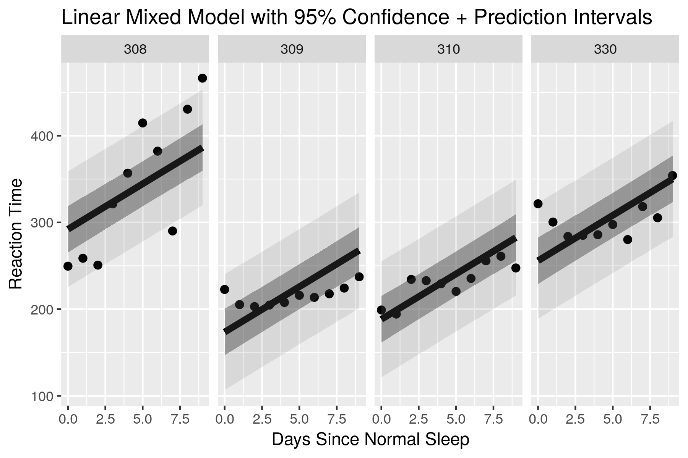

ciTools: An **R** Package for Quick Uncertainty Intervals
=========================================================



[As seen at RStudio::conf2018!](https://github.com/matthewravery/ciTools/blob/master/RStudio-conf-slides.pdf)

Overview
--------

`ciTools` is an **R** package that makes working with model
uncertainty as easy as possible. It gives the user easy access to
confidence or prediction intervals for the fitted values of (log-)
linear models, generalized linear models, and (log-) linear mixed
models. Additionally, we provide functions to determine probabilities
and quantiles of the conditional response distribution given each of
these models.

Why use `ciTools`?
------------------

Uncertainty intervals (confidence or prediction intervals) for fitted
values are easy enough if one is just working with linear models, but
when models become more complex, e.g. generalized linear models or
linear mixed models, the facilities for quantifying uncertainty for
predictions are either more cumbersome to work with or nonexistent. We
hope that `ciTools` provides uniform, model invariant access to these
statistics.

Main Components
---------------

This package has three main features that make it useful to **R** users:

-   Data frame first design - Easily pipe commands together (great for ggplot users)
-   Uniform syntax - all commands have the same simple syntax and sane defaults.
-   Generic design - One command for each statistical quantity

### All commands in `ciTools`:

-   `add_ci(data, fit, ...)` - get confidence intervals and append to `data`
-   `add_pi(data, fit, ...)` - get prediction intervals and append to `data`
-   `add_probs(data, fit, q, ...)` - get conditional response probabilities, Pr(Response|Covariates &lt; `q`)
-   `add_quantile(data, fit, p, ...)` - get conditional response quantiles at level `p`

Installation
------------

Install from CRAN:

``` r
install.packages("ciTools")
library(ciTools)
```

Install `ciTools` from Github with `devtools`:

``` r
library(devtools)
devtools::install_github("jthaman/ciTools")
library(ciTools)
```

If you are behind a corporate firewall, you may have to instead run:

``` r
library(httr)
library(devtools)
httr::set_config(config(ssl_verifypeer = FALSE))
devtools::install_github("jthaman/ciTools")
httr::set_config(config(ssl_verifypeer = TRUE))
library(ciTools)
```

Usage
-----

Here is a short example featuring a linear mixed model, but the idea
is the same for any other model.

``` r
## Example with a linear mixed model

library(ciTools)
library(lme4)
library(tidyverse)

dat <- sleepstudy ## data included with lme4
## Fit a random intercept model
fit <- lmer(Reaction ~ Days + (1 | Subject), data = dat)

## New data for predictions
## A random sample of 20 observations from sleepstudy
new_dat <- sleepstudy[sample(NROW(dat), 20),]

## Append (conditional) 50% CIs and PIs to the new data:
new_dat <- add_ci(new_dat, fit, alpha = 0.5) %>%
    add_pi(fit, alpha = 0.5)

## Append 50% CIs and PIs, but ignore the random effects:
add_ci(new_dat, fit, alpha = 0.5, includeRanef = FALSE,
       names = c("lcb_uncond", "ucb_uncond"), ## custom interval names
       yhatName = "pred_uncond") %>%
    add_pi(fit, alpha = 0.5, includeRanef = FALSE,
           names = c("lpb_uncond", "upb_uncond"))

## Determine the probability that a new Reaction time will be less
## than 300 (given the model and new data):
add_probs(new_dat, fit, 300)

## Or greater than:
add_probs(new_dat, fit, 300, comparison = ">")

## Determine the 0.9-quantile of the predictive distribution, given the
## model and new data:
add_quantile(new_dat, fit, 0.9)

```

The end result is a data frame that is amenable to plotting with
ggplot2. See the documentation for more examples with other types of
statistical regression models.

Scope of `ciTools`
------------------

| Model            | Confidence Intervals | Prediction Intervals | Response Probabilities | Response Quantiles |
|------------------|----------------------|----------------------|------------------------|--------------------|
| Linear           | \[X\]                | \[X\]                | \[X\]                  | \[X\]              |
| Log-Linear       | \[X\]                | \[X\]                | \[X\]                  | \[X\]              |
| GLM              | \[X\]                | \[X\]                | \[X\]                  | \[X\]              |
| Neg. Binomial    | \[X\]                | \[X\]                | \[X\]                  | \[X\]              |
| Linear Mixed     | \[X\]                | \[X\]                | \[X\]                  | \[X\]              |
| Log-Linear Mixed | \[TODO\]             | \[X\]                | \[X\]                  | \[X\]              |
| Survival         | \[X\]             | \[X\]             | \[X\]               | \[X\]           |
| GLMM             | \[X\]             | \[X\]             | \[X\]               | \[X\]           |

\[X\] = Implemented

Help us out?
------------

We still have work to do. Submit an Issue if you run into a bug, or a
PR if you think you can help us out (see the TODO file).

Authors
-------

John Haman and Matt Avery

Copyright
---------

`ciTools` (C) 2017 Institute for Defense Analyses
